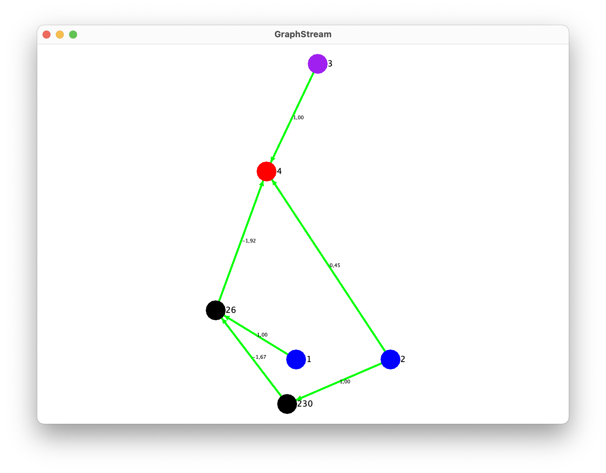
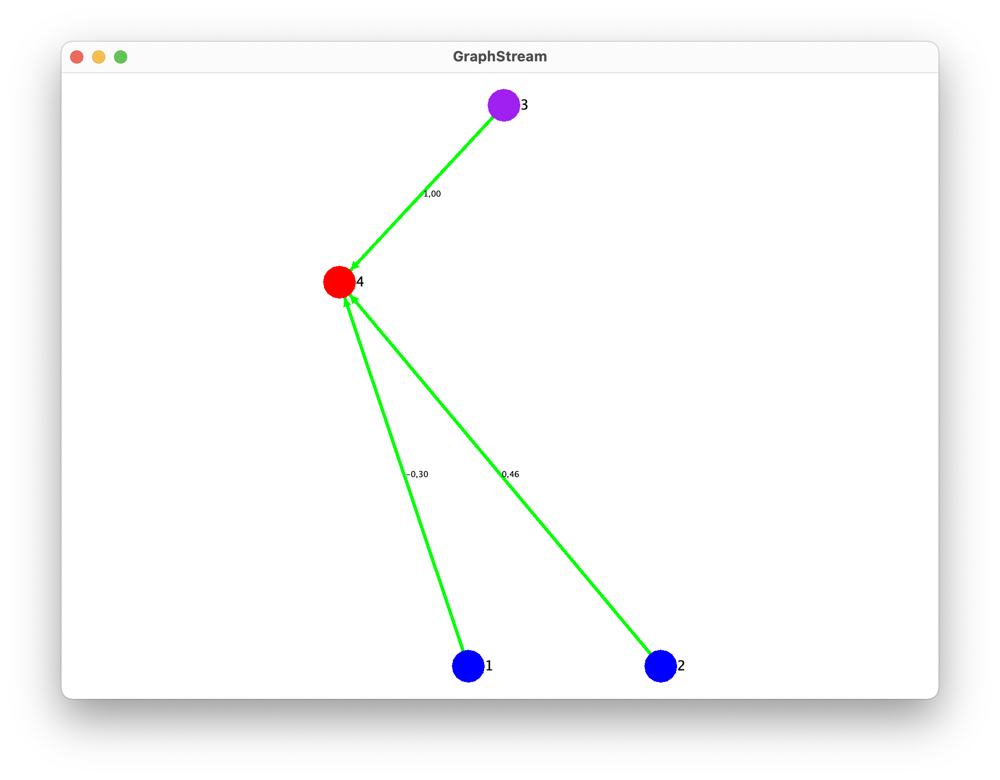
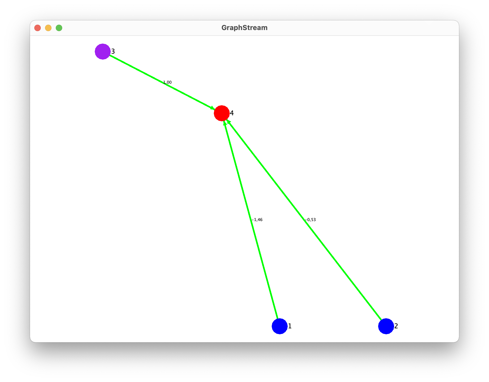
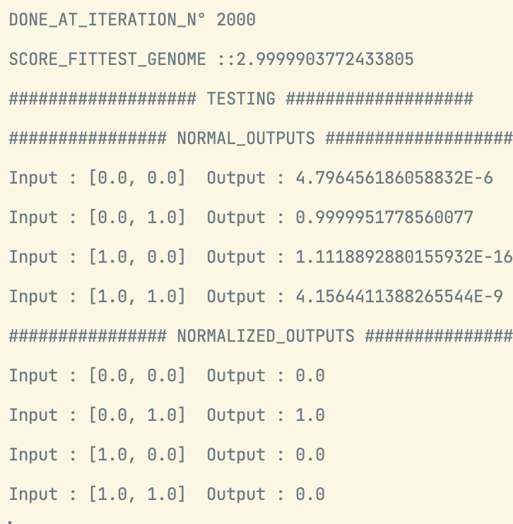
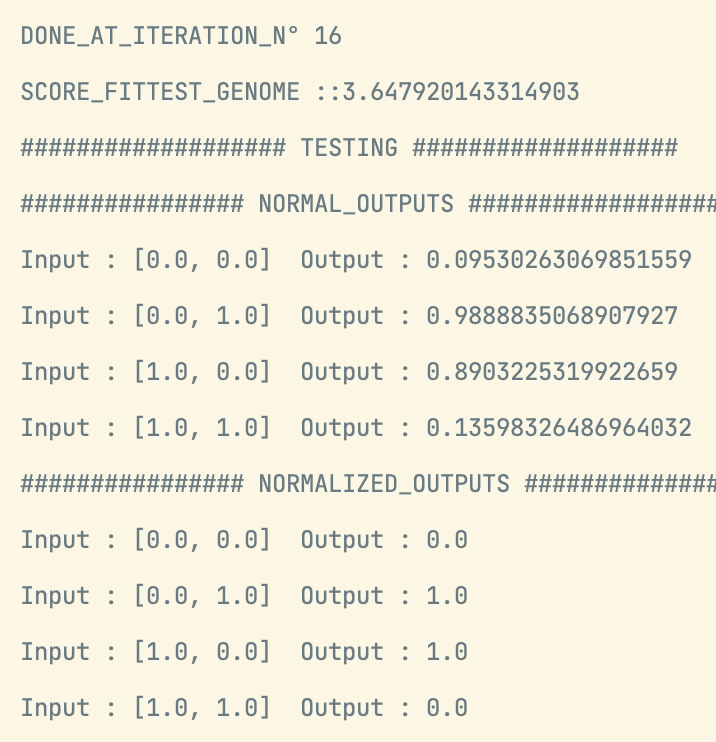

# NeatXorImplementation
## Dépendances
Le projet dépend des librairies suivantes :
- Lombok
- [GraphStream](https://graphstream-project.org) : il s'agit d'une libraire pour représenter des graphes.
```xml
...
<dependencies>

<dependency>
    <groupId>org.projectlombok</groupId>
    <artifactId>lombok</artifactId>
    <version>1.18.24</version>
    <scope>provided</scope>
</dependency>

<dependency>
    <groupId>org.graphstream</groupId>
    <artifactId>gs-core</artifactId>
    <version>1.3</version>
</dependency>

<dependency>
    <groupId>org.graphstream</groupId>
    <artifactId>gs-algo</artifactId>
    <version>1.3</version>
</dependency>

<dependency>
    <groupId>org.graphstream</groupId>
    <artifactId>gs-ui</artifactId>
    <version>1.3</version>
</dependency>

</dependencies>
...
```

## Structure
Ainsi, le projet a été séparé en 2 dossiers principaux
-  algorithm
-  visual
  Le dossier `visual` comprend la class `NeatGraph`qui prend en paramètre un `Genome` et permet de représenter graphiquement les noeuds et les connections de celui-ci. Exemple :
## NeatGraph
Comme expliqué plus haut la class `NeatGraph` permet de représenter les noeuds et les connections d'un `genome`. Exemple :

Dans ce graph, on peut distinguer :
- les noeuds de la couche d'**entrée** : représentés en
  <span style="color:blue">bleu</span>.
- les noeuds de la couche de **sortie** : représentés en
  <span style="color:red">rouge</span>.
- les noeuds de la couche **cachée** : représenté en noir;
- le biais représenté en
  <span style="color:purple">mauve</span>.
  En plus de cela, chaque noeud est représenté avec son identifiant unique.

Au niveau des connections, celles-ci sont représentés en <span style="color:green">vert</span> si la connection est active et en <span style="color:red">rouge</span> sinon. De plus, celles-ci sont représentés avec leur **poids** respectif.

La class `NeatGraph` a ainsi été très utile afin de **visualier** mais également **tester** l'algorithme NEAT.
## L'algorithme NEAT
### Pattern Builder
A l'aide de la librairie utilisé Lombok, le pattern **builder** a été mis en place pour la class `Neat`. Chacun de ses paramètres possèdent une valeur par défaut. Et avec le pattern builder, il suffit d'effectuer ceci pour définir les paramètres souhaités :
```java
Neat neat = Neat.builder()  
                .inputSize(2)
                .outputSize(1)  
                .inputs(inputs)  
                .fitnessFunction(fitness)  
                .solutions(outputs)  
                .BIAS(true)  
                .build();
```
### Représentation du réseau
Un réseau est représenté par la class `Genome` qui comporte une liste de noeuds, une liste de connections et
une fitness.
Les noeuds sont réprésentés par la class `NodeGene` qui comporte :
- un output
- un type (INPUT, HIDDEN, OUTPUT, BIAIS)
- un layer : il s'agit d'un double qui permet d'identifier la position d'un noeud dans le réseau

Les connections sont représentés par la class `ConnectionGene` qui comporte :
- from : le noeud d'entrée
- to : le noeud de sortie 
- weight
- enable (si la connection est activée ou désactivée)

Un dictionnaire reprennant la liste des connections est défini dans la class `Neat` afin d'établir un historique de tous les 
connections de chaque réseau. Ainsi, si une connexion existe déjà dans un autre genome, on pourra la réutiliser.
### Initialisation de la population
Lors de l'initialisation de la population, chaque genome est d'abord initialisé : noeuds d'entrée, sorties et biais. Une fois
chaque genome initialisé, on relie les noeuds d'entrée et le biais éventuelle aux noeuds de sortie. Ainsi, chaque genome
aura une fitness différente pour commencer (ce qui n'était pas le cas lorsque aucun lien n'était initialisé dès le début => tous les genomes
avaient la même fitness).


<p float="center">
  
  

</p>
### Selection
Deux classes sont mises à disposition afin de sélectionner un `Genome` sur base d'une population :
- TournamentSelection
- WheelSelection

_(note : ces 2 méthodes implémente l'interface `Selection` et définisse une méthode `select`)_
### Activation function
Il est possible de passer en paramètres 3 fonctions d'activation :
1. `Sigmoid`
2. `Gaussian`
3. `SteepenedSigmoid` : il s'agit de la fonction sigmoide **ajusté** dans le document NEAT : $1 / (1 + Math.exp(-4.9 * x));$


### Fitness
Une interface `Fitness` a été définie et déclare une méthode pour récupérer la fitness :
```java
double getFitness(Genome genome, double[] solution);
```

Dans le cadre du XOR, le calcul de la fitness a été déterminé comme ci-dessous :
```java
Fitness fitness = (genome, solution) -> {  
    ArrayList<Node>[] layers = genome.getLayers();  
    double score = 4;  
    for (int j = 0; j < inputs.length; j++) {  
        double[] out = genome.computeOutput(layers[0], layers[1], layers[2], inputs[j]);  
        score -= Math.abs(out[0] - outputs[j]);  
    }  
    return score;  
};
```
### Mutation
4 types de mutations ont été implémentées :
- l'ajout d'une connection
- l'ajout d'un noeud
- l'activation ou non d'une connection
- modification du poid d'une connection

Chacune d'elle peut se réaliser si le hasard le décide... au
sein d'une seule mutation pour un `genome` :
```java
public void mutate() {
        if (Math.random() < neat.getCONNECTION_MUTATION_RATE()) {
            mutateAddConnection();
        }
        if (Math.random() < neat.getNODE_MUTATION_RATE()) {
            mutateAddNode();
        }
        if (Math.random() < neat.getENABLE_MUTATION_RATE()) {
            mutateEnableConnection();
        }
        if (Math.random() < neat.getWEIGHT_MUTATION_RATE()) {
            mutateWeightRandomly();
        }
    }
```
### Crossover
````java
public Genome crossOver(Genome parent1, Genome parent2) {
        ...
        for (ConnectionGene c : parent1.getConnectionGenes().getList()) {
            for (ConnectionGene c2 : parent2.getConnectionGenes().getList()) {
                if (c.getInnovationNumber() == c2.getInnovationNumber()) {
                    if (Math.random() < CROSSOVER_RATE) {
                        basicGenome.addConnection(c.cloneConnection());
                    } else {
                        basicGenome.addConnection(c.cloneConnection());
                    }
                }
            }
        }
        List<ConnectionGene> connectionGeneList = findExcessAndDisjoint(parent1, parent2);
        for (ConnectionGene c : connectionGeneList) {
            basicGenome.addConnection(c.cloneConnection());
        }
        ...
        return basicGenome;
    }
````
Ici le crossover permet d'obtenir selon a CROSSOVER_RATE les gènes d'un des 2 parents. En plus de cela, le crossover
ajoute les gènes disjoint et gènes excess.
### Résultats
Dans le cadre du XOR, le nombre d'itérations final varie énormément. Il arrive que le meilleur 
`genome` n'obtienne pas une fitness supérieur à 3(4 étant le maximum défini pour le XOR) et donne ainsi 
3 réponses juste sur 4 :

La cause est qu'il s'agit d'un minimum local et donc on n'arrive pas à en sortir. Pour palier
à ce problème, une solution aurait été la speciation. Cependant, voici un exemple de résultat
pour le XOR sans être tombé dans un minimum local:


### Tests
Comme dit précédemment, l'algorithme NEAT a été principalement testé avec la class `NeatGraph` pour mieux visualiser. Cependant, aucune classe de test n'a été créée.
## TODO
- [ ] ajouter la speciation
- [ ] rendre l'algorithme générique
- [ ] tester l'algorithme avec le platformer
- [ ] ajouter un dictionnaire de noeuds pour la mutation(MutationAddNode)
- [ ] réaliser des tests
